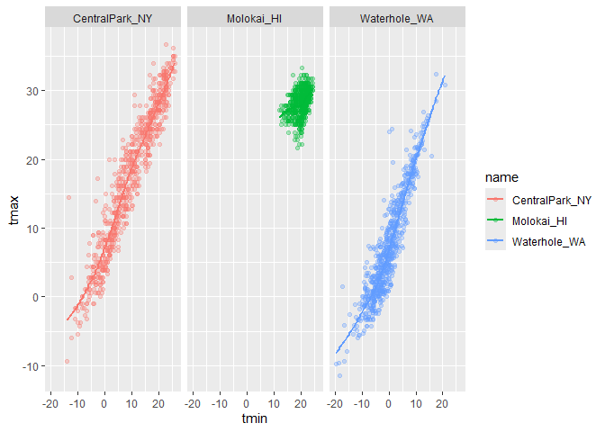
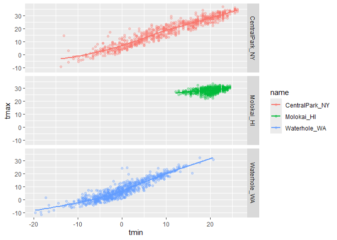
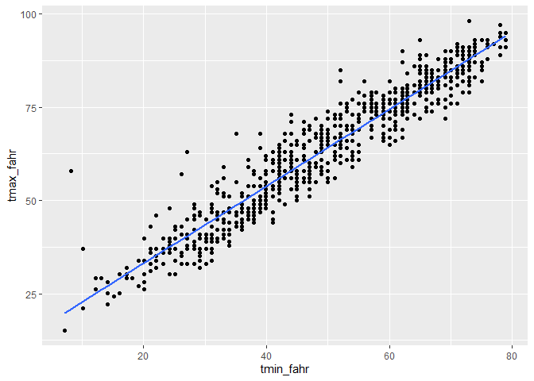
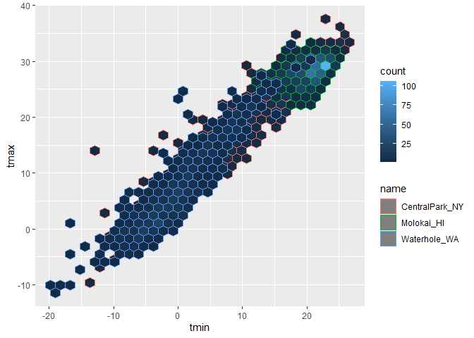
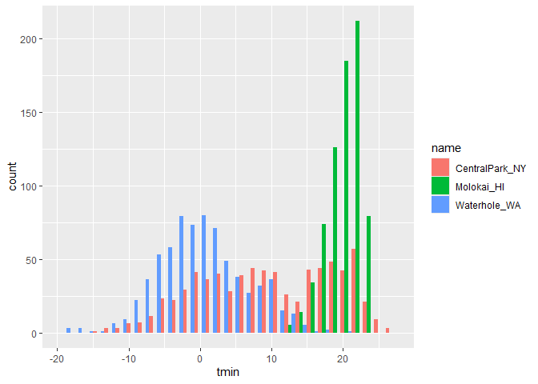
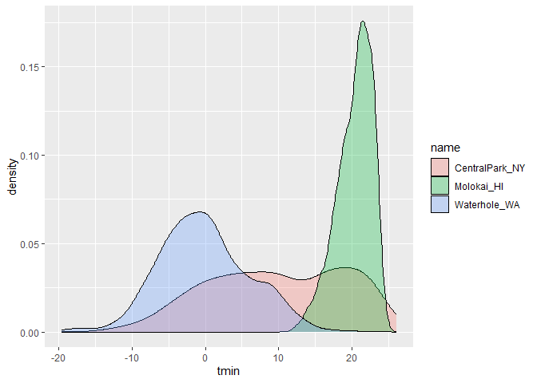
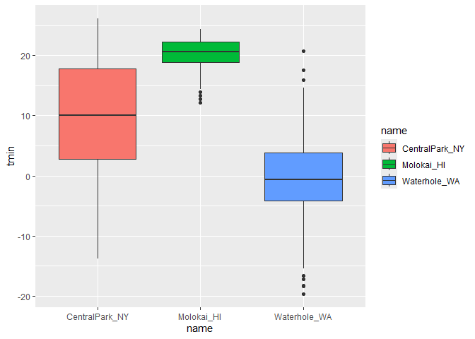
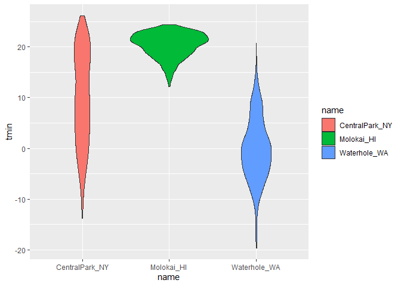
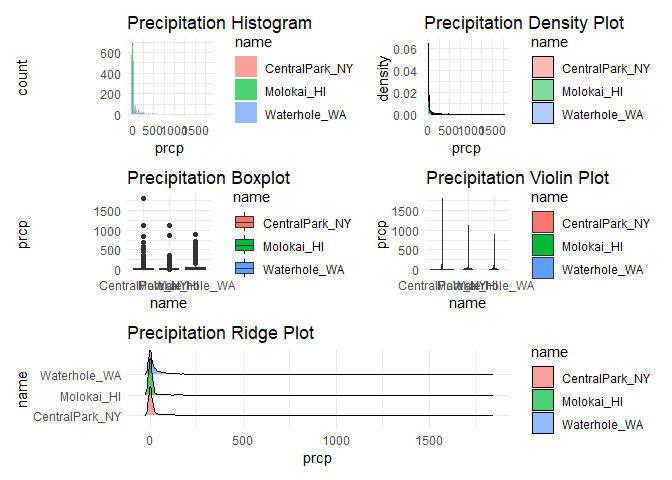
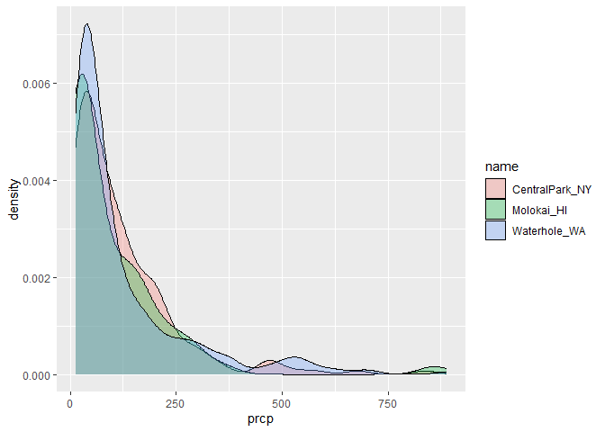

Vis I
================
Xiaoni Xu
2024-09-26

``` r
weather_df = 
  rnoaa::meteo_pull_monitors(
    c("USW00094728", "USW00022534", "USS0023B17S"),
    var = c("PRCP", "TMIN", "TMAX"), 
    date_min = "2021-01-01",
    date_max = "2022-12-31") |>
  mutate(
    name = case_match(
      id, 
      "USW00094728" ~ "CentralPark_NY", 
      "USW00022534" ~ "Molokai_HI",
      "USS0023B17S" ~ "Waterhole_WA"),
    tmin = tmin / 10,
    tmax = tmax / 10) |>
  select(name, id, everything())
```

    ## using cached file: C:\Users\berns\AppData\Local/R/cache/R/rnoaa/noaa_ghcnd/USW00094728.dly

    ## date created (size, mb): 2024-09-26 10:20:22.546961 (8.668)

    ## file min/max dates: 1869-01-01 / 2024-09-30

    ## using cached file: C:\Users\berns\AppData\Local/R/cache/R/rnoaa/noaa_ghcnd/USW00022534.dly

    ## date created (size, mb): 2024-09-26 10:20:50.531719 (3.94)

    ## file min/max dates: 1949-10-01 / 2024-09-30

    ## using cached file: C:\Users\berns\AppData\Local/R/cache/R/rnoaa/noaa_ghcnd/USS0023B17S.dly

    ## date created (size, mb): 2024-09-26 10:20:57.268963 (1.038)

    ## file min/max dates: 1999-09-01 / 2024-09-30

Making the first plot

``` r
ggplot(weather_df, 
       aes(x = tmin, y = tmax)) +
  geom_point()
```

    ## Warning: Removed 17 rows containing missing values or values outside the scale range
    ## (`geom_point()`).

<!-- -->

``` r
ggp_weather_scatterplot = 
  weather_df %>% 
  ggplot(aes(x = tmin, y = tmax)) +
  geom_point()

ggp_weather_scatterplot
```

    ## Warning: Removed 17 rows containing missing values or values outside the scale range
    ## (`geom_point()`).

<!-- -->

``` r
weather_df %>% 
  ggplot(aes(x = tmin, y = tmax, color = name)) +
  geom_point(alpha = .3, size = .8) + 
  geom_smooth(se = FALSE)
```

    ## `geom_smooth()` using method = 'loess' and formula = 'y ~ x'

    ## Warning: Removed 17 rows containing non-finite outside the scale range
    ## (`stat_smooth()`).

    ## Warning: Removed 17 rows containing missing values or values outside the scale range
    ## (`geom_point()`).

<!-- -->

Where you definte aesthetics can matter

``` r
weather_df %>% 
  ggplot(aes(x = tmin, y = tmax)) +
  geom_point(aes(color = name), alpha = .3, size = .8) + 
  geom_smooth(se = FALSE)
```

    ## `geom_smooth()` using method = 'gam' and formula = 'y ~ s(x, bs = "cs")'

    ## Warning: Removed 17 rows containing non-finite outside the scale range
    ## (`stat_smooth()`).

    ## Warning: Removed 17 rows containing missing values or values outside the scale range
    ## (`geom_point()`).

<!-- -->

Use faceting

``` r
weather_df %>% 
  ggplot(aes(x = tmin, y = tmax, color = name)) +
  geom_point(alpha = .3) +
  geom_smooth(se = FALSE) +
  facet_grid(. ~ name) 
```

    ## `geom_smooth()` using method = 'loess' and formula = 'y ~ x'

    ## Warning: Removed 17 rows containing non-finite outside the scale range
    ## (`stat_smooth()`).

    ## Warning: Removed 17 rows containing missing values or values outside the scale range
    ## (`geom_point()`).

<!-- -->

``` r
weather_df %>% 
  ggplot(aes(x = tmin, y = tmax, color = name)) +
  geom_point(alpha = .3) +
  geom_smooth(se = FALSE) +
  facet_grid(name ~ .) # horizontal
```

    ## `geom_smooth()` using method = 'loess' and formula = 'y ~ x'

    ## Warning: Removed 17 rows containing non-finite outside the scale range
    ## (`stat_smooth()`).
    ## Removed 17 rows containing missing values or values outside the scale range
    ## (`geom_point()`).

<!-- -->

Let’s make a somewhat more interesting scatterplot

``` r
weather_df %>% 
  ggplot(aes(x = date, y = tmax, color = name, size = prcp)) +
  geom_point(alpha = .3) + #see the seasonal trends
  geom_smooth(se = FALSE) +
  facet_grid(. ~ name)
```

    ## Warning: Using `size` aesthetic for lines was deprecated in ggplot2 3.4.0.
    ## ℹ Please use `linewidth` instead.
    ## This warning is displayed once every 8 hours.
    ## Call `lifecycle::last_lifecycle_warnings()` to see where this warning was
    ## generated.

    ## `geom_smooth()` using method = 'loess' and formula = 'y ~ x'

    ## Warning: Removed 17 rows containing non-finite outside the scale range
    ## (`stat_smooth()`).

    ## Warning: The following aesthetics were dropped during statistical transformation: size.
    ## ℹ This can happen when ggplot fails to infer the correct grouping structure in
    ##   the data.
    ## ℹ Did you forget to specify a `group` aesthetic or to convert a numerical
    ##   variable into a factor?
    ## The following aesthetics were dropped during statistical transformation: size.
    ## ℹ This can happen when ggplot fails to infer the correct grouping structure in
    ##   the data.
    ## ℹ Did you forget to specify a `group` aesthetic or to convert a numerical
    ##   variable into a factor?
    ## The following aesthetics were dropped during statistical transformation: size.
    ## ℹ This can happen when ggplot fails to infer the correct grouping structure in
    ##   the data.
    ## ℹ Did you forget to specify a `group` aesthetic or to convert a numerical
    ##   variable into a factor?

    ## Warning: Removed 19 rows containing missing values or values outside the scale range
    ## (`geom_point()`).

<!-- -->

Learning assessment: Write a code chain that starts with weather_df;
focuses only on Central Park, converts temperatures to Fahrenheit, makes
a scatterplot of min vs. max temperature, and overlays a linear
regression line (using options in geom_smooth()).

``` r
weather_df %>%
  filter(name == "CentralPark_NY") %>%  # Filter for Central Park
  mutate(
    tmax_fahr = tmax * (9 / 5) + 32,
    tmin_fahr = tmin * (9 / 5) + 32
  ) %>% 
  ggplot(aes(x = tmin_fahr, y = tmax_fahr)) +
  geom_point() +
  geom_smooth(method = 'lm', se = FALSE)
```

    ## `geom_smooth()` using formula = 'y ~ x'

<!-- -->

Smol things

``` r
weather_df %>% 
  ggplot(aes(x = tmin, y = tmax, color = name)) +
  geom_hex()
```

    ## Warning: Removed 17 rows containing non-finite outside the scale range
    ## (`stat_binhex()`).

<!-- -->

``` r
weather_df %>% 
  ggplot(aes(x = tmin, y = tmax)) +
  geom_point(color = "blue")
```

    ## Warning: Removed 17 rows containing missing values or values outside the scale range
    ## (`geom_point()`).

<!-- -->

``` r
weather_df %>% 
  ggplot(aes(x = tmin, y = tmax), color = "blue") + # "blue" is not in the dataset
  geom_point()
```

    ## Warning: Removed 17 rows containing missing values or values outside the scale range
    ## (`geom_point()`).

<!-- -->

## Univariate plots

``` r
weather_df %>% 
  ggplot(aes(x = tmin)) +
  geom_histogram()
```

    ## `stat_bin()` using `bins = 30`. Pick better value with `binwidth`.

    ## Warning: Removed 17 rows containing non-finite outside the scale range
    ## (`stat_bin()`).

<!-- -->

``` r
weather_df %>% 
  ggplot(aes(x = tmin, fill = name)) + # difficult to understand and hard to read if use color = name, according to JEFF
  geom_histogram(position = "dodge")
```

    ## `stat_bin()` using `bins = 30`. Pick better value with `binwidth`.

    ## Warning: Removed 17 rows containing non-finite outside the scale range
    ## (`stat_bin()`).

<!-- -->

How would JEFF fix this?

``` r
weather_df %>% 
  ggplot(aes(x = tmin, fill = name)) +
  geom_histogram() +
  facet_grid(. ~ name)
```

    ## `stat_bin()` using `bins = 30`. Pick better value with `binwidth`.

    ## Warning: Removed 17 rows containing non-finite outside the scale range
    ## (`stat_bin()`).

<!-- -->

Maybe a density plot?

``` r
weather_df %>% 
  ggplot(aes(x = tmin, fill = name)) +
  geom_density(alpha = .3)
```

    ## Warning: Removed 17 rows containing non-finite outside the scale range
    ## (`stat_density()`).

<!-- -->

``` r
weather_df %>% 
  ggplot(aes(x = name, y = tmin, fill = name)) +
  geom_boxplot()
```

    ## Warning: Removed 17 rows containing non-finite outside the scale range
    ## (`stat_boxplot()`).

<!-- -->

Violin plots

``` r
weather_df %>% 
  ggplot(aes(x = name, y = tmin, fill = name)) +
  geom_violin()
```

    ## Warning: Removed 17 rows containing non-finite outside the scale range
    ## (`stat_ydensity()`).

<!-- -->

Ridge plot

``` r
weather_df %>% 
  ggplot(aes(x = tmin, y = name)) +
  geom_density_ridges()
```

    ## Picking joint bandwidth of 1.41

    ## Warning: Removed 17 rows containing non-finite outside the scale range
    ## (`stat_density_ridges()`).

<!-- -->

Learning Assessment: Make plots that compare precipitation across
locations. Try a histogram, a density plot, a boxplot, a violin plot,
and a ridgeplot; use aesthetic mappings to make your figure readable.

``` r
# Histogram
histogram_plot <- weather_df %>%
  ggplot(aes(x = prcp, fill = name)) +
  geom_histogram(position = "dodge", bins = 30, alpha = 0.7) +
  labs(title = "Precipitation Histogram") +
  theme_minimal()

# Density Plot
density_plot <- weather_df %>%
  ggplot(aes(x = prcp, fill = name)) +
  geom_density(alpha = 0.5) +
  labs(title = "Precipitation Density Plot") +
  theme_minimal()

# Boxplot
boxplot_plot <- weather_df %>%
  ggplot(aes(x = name, y = prcp, fill = name)) +
  geom_boxplot() +
  labs(title = "Precipitation Boxplot") +
  theme_minimal()

# Violin Plot
violin_plot <- weather_df %>%
  ggplot(aes(x = name, y = prcp, fill = name)) +
  geom_violin() +
  labs(title = "Precipitation Violin Plot") +
  theme_minimal()

# Ridge Plot
ridge_plot <- weather_df %>%
  ggplot(aes(x = prcp, y = name, fill = name)) +
  geom_density_ridges(aes(height = ..density..), alpha = 0.7) +  # Ensure height aesthetic is specified
  labs(title = "Precipitation Ridge Plot") +
  theme_minimal()

# Combine all plots
combined_plot <- (histogram_plot | density_plot) / 
                 (boxplot_plot | violin_plot) / 
                 ridge_plot

# Display the combined plot
print(combined_plot)
```

    ## Warning: Removed 15 rows containing non-finite outside the scale range
    ## (`stat_bin()`).

    ## Warning: Removed 15 rows containing non-finite outside the scale range
    ## (`stat_density()`).

    ## Warning: Removed 15 rows containing non-finite outside the scale range
    ## (`stat_boxplot()`).

    ## Warning: Removed 15 rows containing non-finite outside the scale range
    ## (`stat_ydensity()`).

    ## Warning: The dot-dot notation (`..density..`) was deprecated in ggplot2 3.4.0.
    ## ℹ Please use `after_stat(density)` instead.
    ## This warning is displayed once every 8 hours.
    ## Call `lifecycle::last_lifecycle_warnings()` to see where this warning was
    ## generated.

    ## Picking joint bandwidth of 9.22

    ## Warning: Removed 15 rows containing non-finite outside the scale range
    ## (`stat_density_ridges()`).

<!-- -->

``` r
weather_df %>%
  filter(prcp > 10, prcp < 1000) %>% 
  ggplot(aes(x = prcp, fill = name)) +
  geom_density(alpha = .3)
```

<!-- -->
